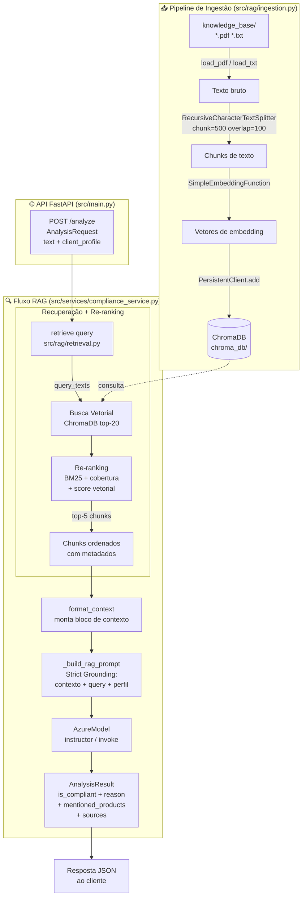
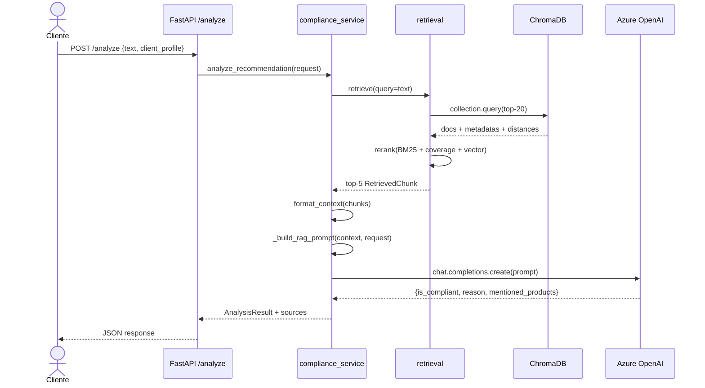

# Arquitetura do Sistema RAG — Compliance Checker API

## Visão Geral

O sistema é composto por dois fluxos principais:

1. **Pipeline de Ingestão** (offline, executado uma vez ou sob demanda)
2. **Fluxo de Análise RAG** (online, a cada requisição ao endpoint `/analyze`)

---

## Diagrama de Fluxo Completo



---

## Componentes

### `src/rag/ingestion.py` — Pipeline de Ingestão

| Etapa | Detalhe |
|---|---|
| **Leitura** | `PdfReader` (pypdf) para PDFs; `Path.read_text` para TXT |
| **Chunking** | `RecursiveCharacterTextSplitter` — tamanho 500, overlap 100 |
| **Embedding** | `SimpleEmbeddingFunction` (offline, sem dependência externa) |
| **Armazenamento** | `chromadb.PersistentClient` — coleção `compliance_knowledge` |
| **Idempotência** | `delete_collection` antes de recriar — garante base sempre atualizada |

### `src/rag/retrieval.py` — Serviço de Recuperação

| Etapa | Detalhe |
|---|---|
| **Busca vetorial** | `collection.query` — retorna os 20 chunks mais próximos |
| **Re-ranking** | Score combinado: `0.5×BM25 + 0.3×cobertura + 0.2×score_vetorial` |
| **Saída** | Top-5 `RetrievedChunk` ordenados por `rerank_score` |

#### Fórmula de Re-ranking

```
rerank_score = 0.5 × BM25(query, chunk)
             + 0.3 × cobertura_de_termos(query, chunk)
             + 0.2 × (1 / (1 + distância_vetorial))
```

- **BM25**: penaliza documentos muito longos e premia frequência de termos da query
- **Cobertura**: fração de termos únicos da query presentes no chunk
- **Score vetorial**: proximidade semântica calculada na busca inicial

### `src/api/schemas.py` — Contratos da API

```
AnalysisRequest          AnalysisResult
─────────────────        ──────────────────────────────────
text            →        is_compliant: bool
client_profile  →        reason: str
                         mentioned_products: List[str]
                         sources: List[SourceReference]
                                  ├── source_document
                                  ├── source_chunk_id
                                  ├── relevance_score
                                  └── excerpt
```

### `src/services/compliance_service.py` — Orquestrador RAG

1. Chama `retrieve(query)` → obtém chunks re-rankeados
2. Chama `format_context(chunks)` → formata bloco de contexto
3. Constrói prompt com **Strict Grounding** (LLM instruído a usar APENAS o contexto)
4. Chama `AzureModel` via `instructor` (saída estruturada) ou `invoke` (fallback)
5. Mescla resultado do LLM com `sources` vindos do retrieval

---

## Fluxo de Dados — Diagrama de Sequência



---

## Estrutura de Arquivos Relevantes

```
project-1/
├── knowledge_base/          # Documentos oficiais (PDFs + TXTs)
├── chroma_db/               # Banco vetorial persistido
├── src/
│   ├── main.py              # Ponto de entrada FastAPI
│   ├── api/
│   │   └── schemas.py       # AnalysisRequest, AnalysisResult, SourceReference
│   ├── core/
│   │   └── llm_client.py    # AzureModel (wrapper Azure OpenAI)
│   ├── rag/
│   │   ├── ingestion.py     # Pipeline de ingestão (offline)
│   │   └── retrieval.py     # Busca vetorial + re-ranking
│   └── services/
│       └── compliance_service.py  # Orquestrador RAG
└── notebooks/
    └── rag_evaluation.ipynb # Análise before/after re-ranking
```
